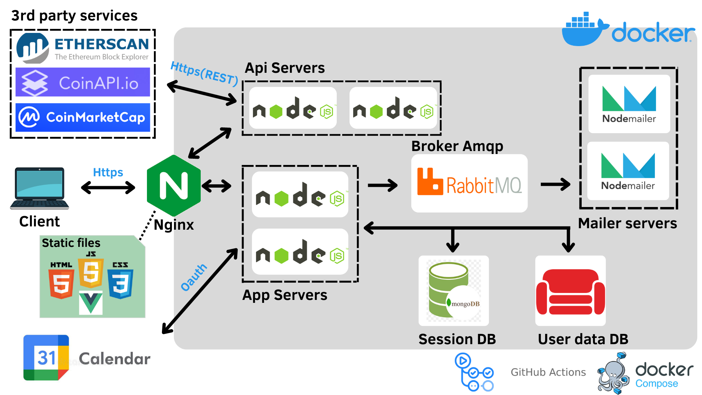

# ProgettoRCLTW
Web App | MyCryptoWallet


# Scopo del Progetto
MyCryptoWallet è una web app che fornisce una serie di tools per il tracking degli investimenti degli utenti in criptovalute, con statistiche, grafici, e informazioni in tempo reale.
L'app ha 4 sezioni:
- DASHBOARD: 
    la schermata principale con tutte le informazioni piu rilevanti (profitti, perdite, valore degli asset, variazioni del valore nel tempo...). L'utente può inserire/rimuovere le criptovalute che ha acquistato/venduto
- GAS TRACKER: 
    permette di vedere in tempo reale il costo del gas sulla rete ethereum
- CALENDAR: 
    permette ,attraverso l'integrazione con Google Calendar, di visualizzare i prossimi impegni che l'utente ha impostato sul calendario google.(Utile per gli utenti che vogliono investire periodicamente, e vogliono impostare dei promemoria)
- ROI CALCULATOR: 
    permette di calcolare il ritorno che l'utente si aspetta dai suoi investimenti
# Architettura e tecnologie

il diagramma riporta l'architettura e le tecnologie utilizzate.
Per motivi grafici non è stato riportato nel diagramma che i container parlano tra di loro sulla rete virtuale di docker "app-network" attraverso il protocollo http(non è necessario https visto che si tratta di una rete privata),l'unica eccezione è il sistema asincrono per l'invio delle mail che parla il protocollo amqp
# Requisiti
Le specifiche di progetto sono state rispettate:
1. MCW offre delle api documentate con apidoc a terze parti
2. MCW si interfaccia con 4 servizi di terze parti:
    - Google calendar
    - Coinmarketcap.com
    - Coinapi.io
    - Etherscan
3. dei servizi con cui MCW si interfaccia 3 sono commerciali(Google, Etherscan, Coinmarketcap.com)
4. MCW usa il protocollo OAUTH per accedere ai servizi di Google calendar
5. MCW usa il protocollo asincrono Amqp per l'accodamento e la gestione asincrona e bilanciata dell'invio delle mail di benvenuto dopo la registrazione
6. i processi di lancio e configurazione sono automatizzati mediante l'uso dell'orchestratore "docker-compose", mentre i test sono automatizzati tramite i framework "mocha" e "chai".
7. il progetto è pubblico e documentato
8. vengono usate le github actions per il testing automatico dei servizi offerti da MCW
9. sicurezza:
    - il reverse proxy (nginx) parla https con i clients.(per gli scopi del progetto usiamo un self signed certificate)
    - le password degli utenti registrati vengono cifrate prima di essere salvate su db
# Istruzioni per l'installazione
0. Pre requisiti
    prima di procedere dobbiamo avere installato sul nostro sistema:
    - docker e docker-compose
    - npm
    - git 
1. clonare la repository dell'applicazione
```bash
 $ git clone https://github.com/lucianolazzari00/ProgettoRCLTW.git
```
2. aggiungere files di configurazione:

    nella repository non sono presenti i files .env per la configurazione dei servers poiche contengono informazioni private (keys,tokens,secrets...).
    la nostra applicazione ha tre servers(app server,api server, mailer server), ognuno di questi ha bisogno di un file .env per la configurazione.

    Dunque:

    - creiamo il file .env strutturato come segue e lo inseriamo nella cartella backend/src/api

        (per ottenere le chiavi e necessario registrarsi ai rispettivi servizi)

        ```
        MODE=dev
        COIN_API_KEY = /*****your_key******/
        CMC_API_KEY = /*****your_key******/
        ETH_SCAN_API_KEY = /*****your_key******/
        ```

    - creiamo il file .env strutturato come segue e lo inseriamo nella cartella backend/src/app

        (per ottnere client id e client secret e necessario registarsi su google cloud console)

        ```
        CLIENT_ID = /*****your_client_id*****/
        CLIENT_SECRET = /*****your_client_secret*****/
        PSW_SECRET = /*****the string that will sign the passwords in the db****/
        ```

    - creiamo il file .env strutturato come segue e lo inseriamo nella cartella backend/src/mailer

        ```
        EMAIL_USER=/****indirizzo dal quale verrano inviate le mail di benvenuto*****/
        EMAIL_PSW=/****psw dell'account mail****/
        ```

3. inoltre dobbiamo generare le chiavi pubbliche/private e il certficato.

    Dopo aver generato le chiavi avremo quattro files:
    - nginx.crt
    - nginx.csr
    - nginx.key
    - dhparam.pem

    dobbiamo creare una cartella "certs" all'interno della cartella "backend" e inserire i quattro files precedentemente generati

4. infine dobbiamo installare le dependencies, possiamo farlo direttamente dalla root folder con i comandi:
    ```
    npm --prefix ./backend/src/api install
    npm --prefix ./backend/src/app install
    npm --prefix ./backend/src/mailer install
    ```
    
# Istruzioni per il test
```
npm test
```
# ApiDoc


